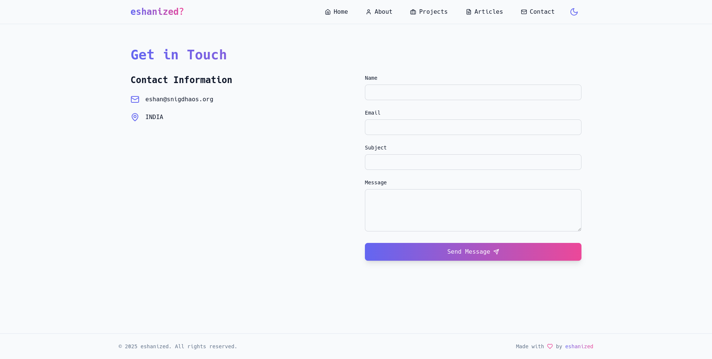

# Eshanized GitLab Pages 🚀

Welcome to the Eshanized GitLab Pages repository! This repository hosts the source code for my personal website, built using React, Tailwind CSS, and hosted on GitLab Pages.

[](https://gitlab.com/eshanized/eshanized.gitlab.io/-/commits/main)
[](https://gitlab.com/eshanized/eshanized.gitlab.io/-/commits/main)
[](https://opensource.org/licenses/MIT)
[](https://reactjs.org/)
[](https://tailwindcss.com/)

## Table of Contents

- [About](#about)
- [Features](#features)
- [Getting Started](#getting-started)
  - [Prerequisites](#prerequisites)
  - [Installation](#installation)
- [Usage](#usage)
- [Contributing](#contributing)
- [License](#license)
- [Contact](#contact)

## About 📝

This repository contains the source code for my personal website. The website is built using React and Tailwind CSS for styling, and it is hosted on GitLab Pages. It serves as a portfolio, blog, and a place to share my projects and thoughts.

## Features ✨

- **React**: A powerful JavaScript library for building user interfaces.
- **Tailwind CSS**: A utility-first CSS framework for rapid UI development.
- **Responsive Design**: Optimized for various screen sizes and devices.
- **Blog**: A section to share articles and thoughts.
- **Portfolio**: Showcase of my projects and work.
- **SEO Optimized**: Ensures better visibility on search engines.
- **Dark Mode**: Support for dark mode to reduce eye strain.
- **Social Media Integration**: Easy sharing of content on social media platforms.

## Getting Started 🛠️

### Prerequisites

Before you begin, ensure you have met the following requirements:

- You have installed the latest version of [Git](https://git-scm.com/).
- You have a [GitLab](https://gitlab.com/) account.
- You have [Node.js](https://nodejs.org/) and [pnpm](https://pnpm.io/) installed.

### Installation

1. Clone the repository:

   ```sh
   git clone https://gitlab.com/eshanized/eshanized.gitlab.io.git
   ```

2. Navigate to the project directory:

   ```sh
   cd eshanized.gitlab.io
   ```

3. Install the necessary dependencies using pnpm:

   ```sh
   pnpm install
   ```

## Usage 💻

To start the development server:

```sh
pnpm dev
```

Open your browser and navigate to `http://localhost:3000` to view your site.

To build the project for production:

```sh
pnpm build
```

## Contributing 🤝

Contributions are what make the open-source community such an amazing place to learn, inspire, and create. Any contributions you make are **greatly appreciated**.

1. Fork the Project
2. Create your Feature Branch (`git checkout -b feature/AmazingFeature`)
3. Commit your Changes (`git commit -m 'Add some AmazingFeature'`)
4. Push to the Branch (`git push origin feature/AmazingFeature`)
5. Open a Merge Request

## License 📜

Distributed under the MIT License. See `LICENSE` for more information.

## Contact 📧

Eshan - [@eshanized](https://gitlab.com/eshanized) - m.eshanized@gmail.com

Project Link: [https://gitlab.com/eshanized/eshanized.gitlab.io](https://gitlab.com/eshanized/eshanized.gitlab.io)

## Acknowledgments 🙏

- Thanks to the open-source community for their contributions and support.
- Inspiration and ideas from various personal websites and blogs.

## Screenshots 📸




## Roadmap 🗺️

- [ ] Add more blog posts
- [ ] Improve SEO and performance
- [ ] Add more interactive elements
- [ ] Integrate with more social media platforms

## FAQ ❓

**Q: How can I contribute?**

A: You can contribute by forking the repository, creating a feature branch, making your changes, and opening a merge request.

**Q: What technologies are used?**

A: The website is built using React, Tailwind CSS, and hosted on GitLab Pages.

**Q: How can I contact you?**

A: You can reach out to me via email at eshan@example.com or through my GitLab profile [@eshanized](https://gitlab.com/eshanized).
