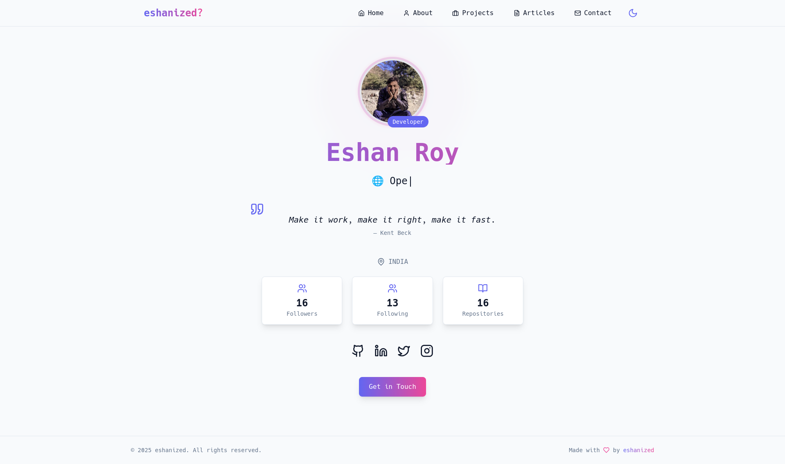
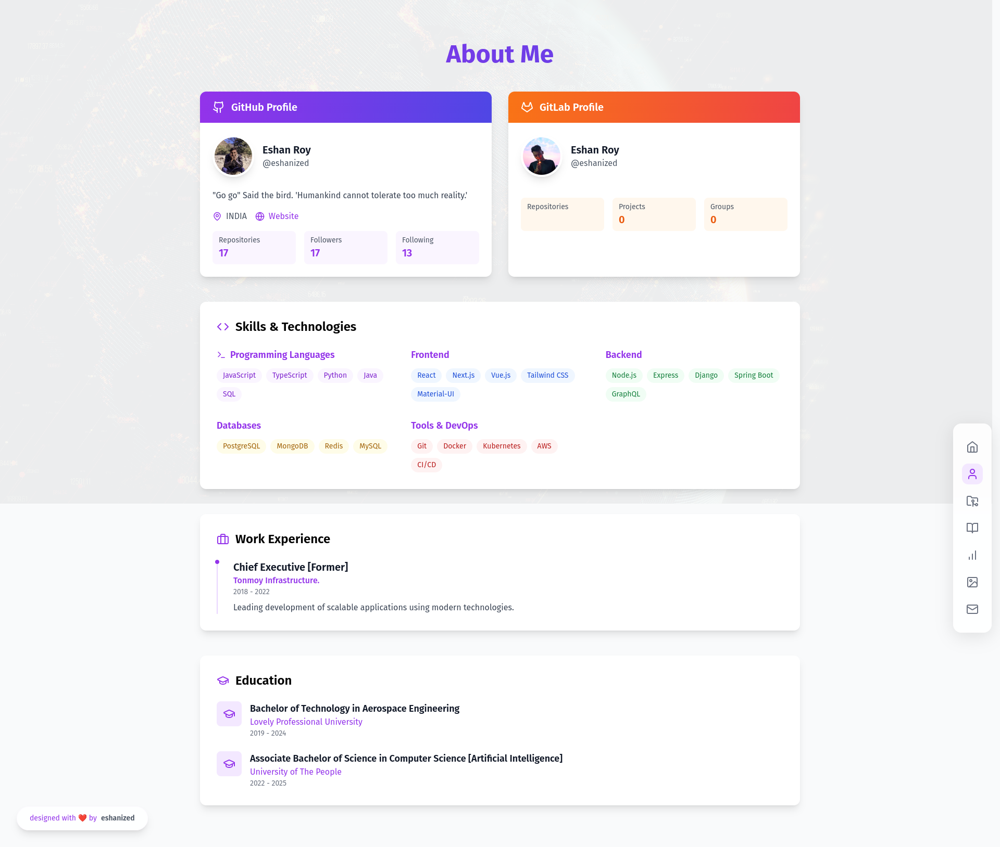
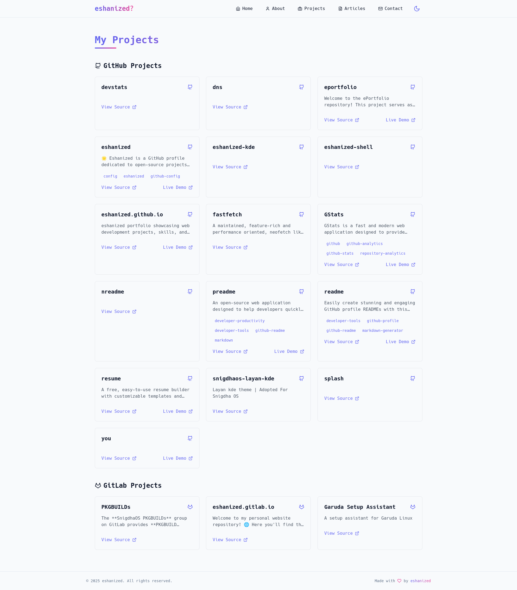
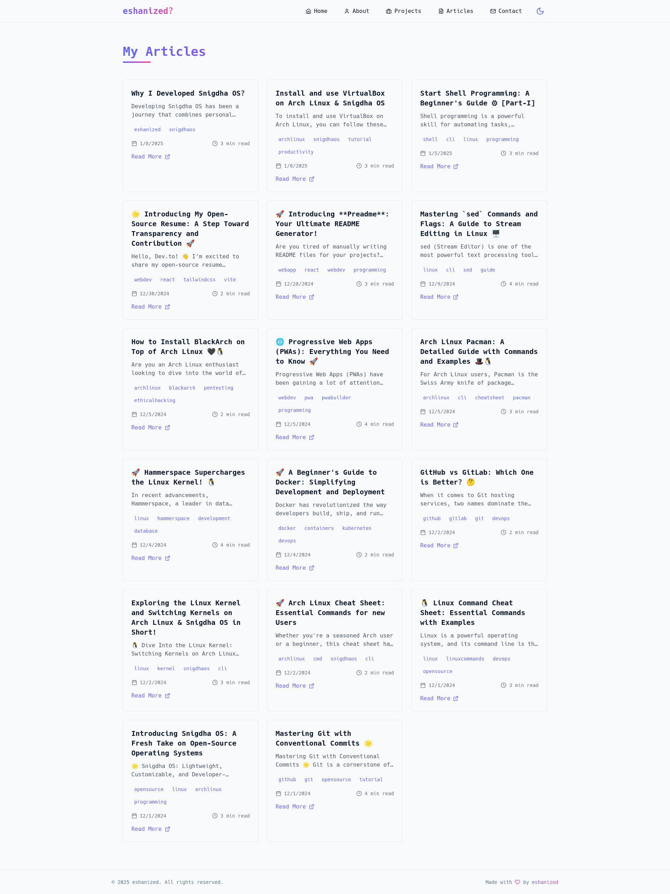
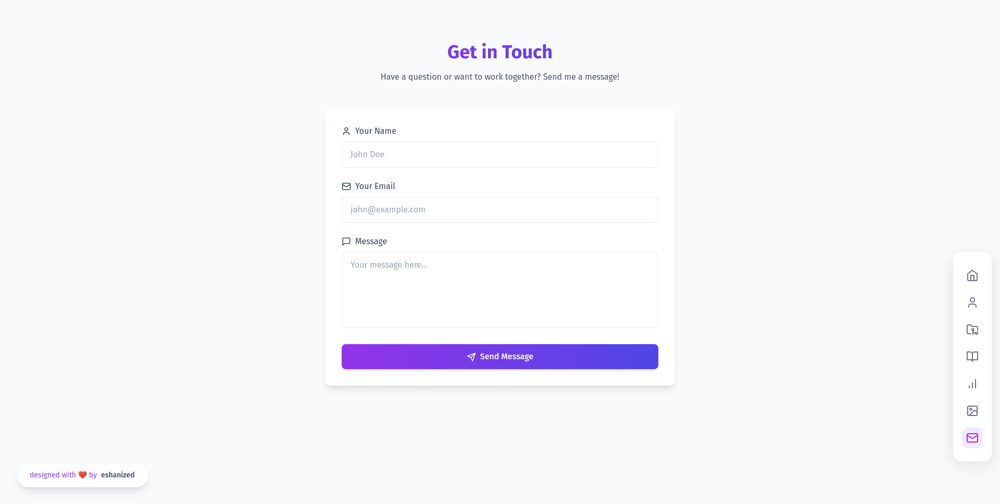

# **Eshanized Portfolio Website** 🎨🚀  

Welcome to **Eshanized GitLab Pages**! This is the source code for my personal portfolio website, built with **React**, **Tailwind CSS**, and hosted on **GitLab Pages**.  

🌐 **Live Site:** [eshanized.gitlab.io](https://gitlab.com/eshanized/eshanized.gitlab.io)  

[](https://gitlab.com/eshanized/eshanized.gitlab.io/-/commits/main)  
[](https://gitlab.com/eshanized/eshanized.gitlab.io/-/commits/main)  
[](https://opensource.org/licenses/MIT)  
[](https://reactjs.org/)  
[](https://tailwindcss.com/)  


## 📖 **Table of Contents**  
- [🌟 About](#-about)  
- [🚀 Features](#-features)  
- [🛠️ Getting Started](#-getting-started)  
  - [🔗 Prerequisites](#-prerequisites)  
  - [📥 Installation](#-installation)  
- [💻 Usage](#-usage)  
- [🤝 Contributing](#-contributing)  
- [📜 License](#-license)  
- [📧 Contact](#-contact)  
- [📸 Screenshots](#-screenshots)  
- [🗺️ Roadmap](#-roadmap)  
- [❓ FAQ](#-faq)  


## 🌟 **About**  

This repository contains my **personal portfolio website**, designed to showcase my **projects, blog, and skills**. Built with **React & Tailwind CSS**, it is lightweight, responsive, and optimized for performance.  

🖥️ **Tech Stack:**  
✔ **React** – Frontend framework  
✔ **Tailwind CSS** – Styling with utility classes  
✔ **Vite** – Lightning-fast development  
✔ **GitLab Pages** – Hosting platform  


## 🚀 **Features**  

✨ **Modern UI** – Clean & minimalistic design  
📱 **Responsive Design** – Fully optimized for all devices  
🌙 **Dark Mode** – Easy on the eyes with a toggle  
📝 **Blog Section** – Write and share your thoughts  
📂 **Portfolio Showcase** – Display projects beautifully  
🔍 **SEO Optimized** – Boost visibility on search engines  
📢 **Social Media Integration** – Easy content sharing  


## 🛠️ **Getting Started**  

### 🔗 **Prerequisites**  
Before running the project, ensure you have:  
- 📌 [Git](https://git-scm.com/) installed  
- 📌 A [GitLab](https://gitlab.com/) account  
- 📌 [Node.js](https://nodejs.org/) installed  
- 📌 [pnpm](https://pnpm.io/) installed  

### 📥 **Installation**  

1️⃣ **Clone the repository:**  
```sh
git clone https://gitlab.com/eshanized/eshanized.gitlab.io.git
```  

2️⃣ **Navigate to the project directory:**  
```sh
cd eshanized.gitlab.io
```  

3️⃣ **Install dependencies:**  
```sh
pnpm install
```  


## 💻 **Usage**  

🔥 Start the development server:  
```sh
pnpm dev
```  
🔗 Open **http://localhost:3000** in your browser  

⚡ Build the project for production:  
```sh
pnpm build
```  


## 🤝 **Contributing**  

🎉 **Want to contribute?** Amazing! Here’s how:  

1. **Fork the repository**  
2. **Create a new branch** (`git checkout -b feature/AmazingFeature`)  
3. **Commit your changes** (`git commit -m 'Add some AmazingFeature'`)  
4. **Push to the branch** (`git push origin feature/AmazingFeature`)  
5. **Open a Merge Request**  

🙌 Every contribution is **highly appreciated**!  


## 📜 **License**  

This project is licensed under the **MIT License**. See [`LICENSE`](LICENSE) for details.  


## 📧 **Contact**  

📌 **Eshan** – [@eshanized](https://gitlab.com/eshanized)  
📩 **Email** – [m.eshanized@gmail.com](mailto:m.eshanized@gmail.com)  

🔗 **Project Link:** [Eshanized GitLab Pages](https://gitlab.com/eshanized/eshanized.gitlab.io)  


## 📸 **Screenshots**  

📍 **Homepage**  
  

📍 **About Section**  
  

📍 **Projects Showcase**  
  

📍 **Blog Section**  
  

📍 **Contact Page**  
  


## 🗺️ **Roadmap**  

✅ Initial Portfolio Release  
📌 **Upcoming Features:**  
- [ ] ✍ Add more blog posts  
- [ ] 📈 Improve SEO & performance  
- [ ] 🎨 Enhance UI/UX animations  
- [ ] 🔗 Integrate more social media platforms  


## ❓ **FAQ**  

🔹 **Q: How can I contribute?**  
👉 Fork the repo, create a feature branch, make changes, and submit a **merge request**!  

🔹 **Q: What technologies are used?**  
👉 The website is built with **React, Tailwind CSS**, and deployed on **GitLab Pages**.  

🔹 **Q: How can I contact you?**  
👉 Reach me at **m.eshanized@gmail.com** or [@eshanized](https://gitlab.com/eshanized).  


🔥 **If you like this project, consider giving it a ⭐!** 🚀  
